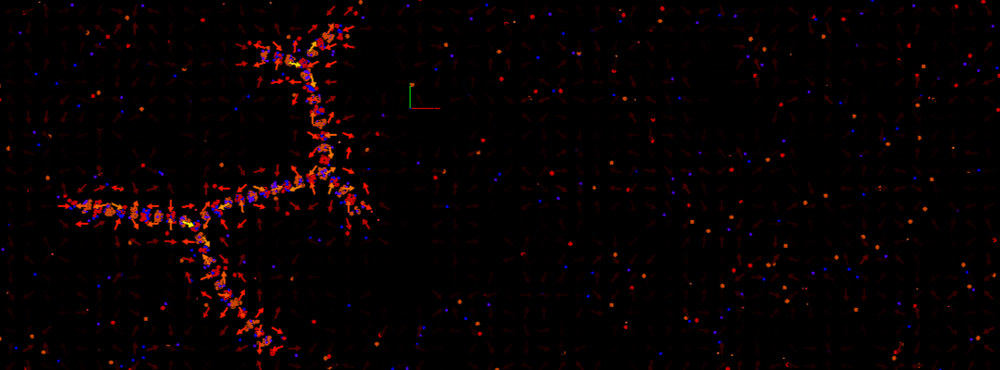
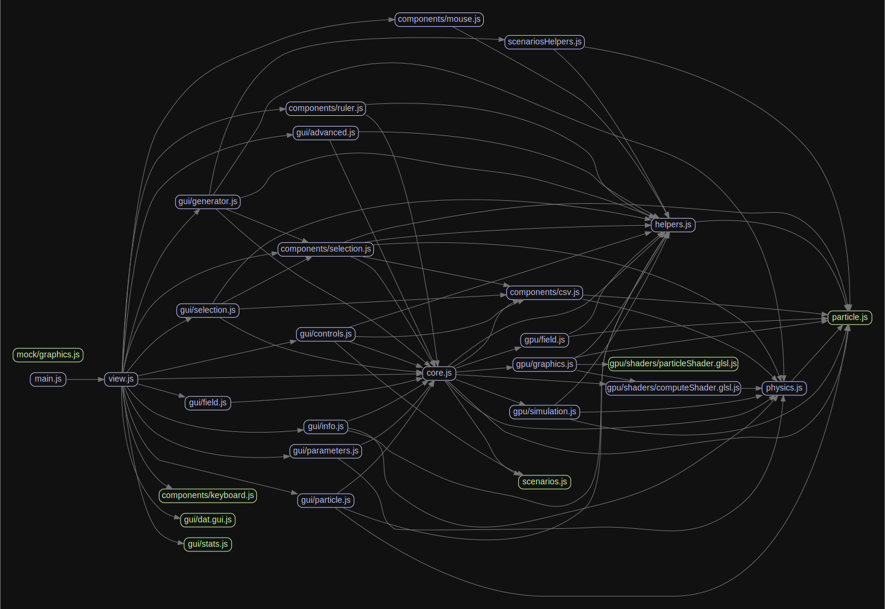

# particle.js



## About

A JavaScript 3D n-body particle simulator using a simplified model of Physics.

Try to simulate 3 forces on point-like particles:
- Gravity
- Electromagnetic
- Nuclear force (an analogy to the Strong Force)

Live demo: [particle.js](https://andrenepomuceno.github.io/particle.js/)

## Build

[](https://github.com/andrenepomuceno/particle.js/actions/workflows/webpack.yml)

To run the test server on `localhost:8080`
```
git clone https://github.com/andrenepomuceno/particle.js.git
cd particle.js
npm install
npm run test
````

To build the production package:
```
npm run build
```

## Features
- Real time simulation
- Runs on GPU.
- Supports 2D and 3D modes.
- Can export and import simulations.
- Adjustable parameters during runtime.
- Vector field visualization.
- Interactive simulation and particles. Almost everything is editable!
- Sandbox Mode
- And much more...

## Youtube Playlist

[Click Here](https://www.youtube.com/watch?v=z5RhBaDnkOE&list=PLr48cTU7J6cyvKp1v-1bpH4j5qCZbR-AV)

## Mathematical Model
Main considerations:
- Each particle is a point (no volume) in space.
- Particles have vectorial properties like position and velocity.
- Particles have scalar properties like mass, charge and "nuclear charge".
- Particles interact and collide with each other every simulation step.
- Uses Coulomb's Law for electromagnetism and Newton's Law for gravity.
- Uses an approximate nuclear force, trying to imitate the Strong Force.

For each particle $P_i$, with mass $m_i$, charge $q_i$ and nuclear charge $n_i$, the resulting force acting on this particle is
$$\vec{F}(P_i)=\sum_{j \ne i}^N [\vec{F_g}(P_i,P_j) + \vec{F_e}(P_i,P_j) + \vec{F_n}(P_i,P_j)]$$
where $F_g$, $F_e$ and $F_n$ are respectively the forces by the gravitational, electromagnetic and nuclear fields:

$$\vec{F_g}(P_i,P_j)=k_g.\frac{m_i.m_j}{||\vec{d_{ij}}||^2}.\bar{d_{ij}}$$

$$\vec{F_e}(P_i,P_j)=-k_e.\frac{q_i.q_j}{||\vec{d_{ij}}||^2}.\bar{d_{ij}}$$

$$\vec{F_n}(P_i,P_j)=k_n.n_i.n_j.V(||\vec{d_{ij}}||).\bar{d_{ij}}$$

where

$\vec{d_{ij}} = \vec{x_j} - \vec{x_i}$

and $V(d)$ represents the nuclear potential, that can be any nuclear potential function like Yukawa, Reci, Lennard-Jones, Av18 potentials and so on...

For this project, the default is

$V(d \le d_{max})=\sin{(2.\pi.\frac{d}{d_{max}})}$.

Function $V(d)$ can be also be described as just $V(d) = \frac{2.d - d_{max}}{d_{max}}$, becoming similar to Hooke's Law.

So, the velocity of the particle is described by

$$\frac{d\vec{v_i}}{dt} = \vec{a} = \frac{\vec{F}(P_i)}{m_i}$$

And the position

$$\frac{d\vec{x_i}}{dt} = \vec{v_i}$$

### Collisions

A collision occurs when the distance between two particles is less than a minimal allowed distance $d_{min}$.

In the case of a collision between $P_1$ and $P_2$, the conservation of momentum and energy are applied:

$$m_1 \vec{v_1} + m_2 \vec{v_2} = m_1 \vec{u_1} + m_2 \vec{u_2}$$

$$m_1 \vec{v_1}^2 + m_2 \vec{v_2}^2 = m_1 \vec{u_1}^2 + m_2 \vec{u_2}^2$$

Where $u_i$ is the final velocity of $P_i$.

So, the force exerted by a collision is (a lot of omitted calculus here...)

$$F(P_1) = \frac{2 m_1 m_2}{m_1 + m_2} \frac{\vec{v_{21}}.\vec{d_{21}}}{||\vec{d_{21}}||^2} \vec{d_{21}} $$

## Code Archtecture



## Donate

**BTC:** 187JHUUqszdB9fC6Nn52CpP7UsEeD8GsNh

**Github Sponsor:** https://github.com/sponsors/andrenepomuceno

## Special Thanks

Big thanks to [three.js](https://threejs.org/) guys who made this amazing WebGL library, making the entire process a lot easier and fun.
