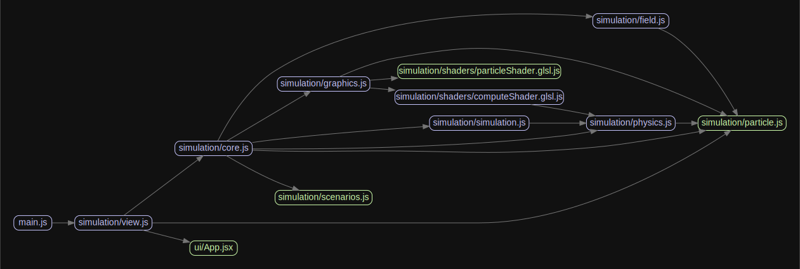

# particle.js


## Table of Contents  

[About](#about)

[Features](#features)

[Mathematical Model](#mathematical-model)

[Build](#build)

[Special Thanks](#special-thanks)

## About

Particle.js is a JavaScript 3D n-body particle simulator that uses a simplified model of Physics.

Try to simulate 3 forces on point-like particles:
- Gravity
- Electromagnetic
- Nuclear force

### Features
- Real time simulations
- Runs particle interaction computations in parallel on GPU.
- Supports 2D and 3D modes.
- Can export and import simulations.
- Adjustable parameters during runtime.
- Vector field visualization.
- Interactive simulation and particles. Almost everything is editable!
- Sandbox Mode
- And much more...

### Live Demo

[particle.js](https://andrenepomuceno.github.io/particle.js/)

### Media

[Youtube Playlist](https://www.youtube.com/watch?v=z5RhBaDnkOE&list=PLr48cTU7J6cyvKp1v-1bpH4j5qCZbR-AV)

[Photo Gallery](https://photos.app.goo.gl/1x41ZhipNKr5yrYa7)

## Mathematical Model
Main considerations:
- Each particle is a point (no volume) in space.
- Particles have vectorial properties like position $\vec{x_i}$ and velocity $\vec{v_i}$.
- Particles have scalar properties like mass $m_i$, charge $q_i$ and nuclear charge $n_i$.
- Particles interact in pairs each simulation step $\Delta t$.
- Particles can collide if $d \le d_{min}$.
- There is a maximum speed *c* so $|\vec{v_i}| \le c$.
- Uses Coulomb's Law for electromagnetism and Newton's Law for gravity.
- Uses a limited range potential for nuclear force, trying to model the Strong Force.

For each particle $P_i$, with mass $m_i$, charge $q_i$ and nuclear charge $n_i$, the resulting force acting on this particle is

$$\vec{F}(P_i)=\sum_{j \ne i}^N [\vec{F_g}(P_i,P_j) + \vec{F_e}(P_i,P_j) + \vec{F_n}(P_i,P_j)].\bar{n_{ij}}$$

$$\vec{d_{ij}} = \vec{x_j} - \vec{x_i}$$

$$d = |\vec{d_{ij}}|$$

$$\bar{n_{ij}} = \frac{|\vec{d_{ij}}|}{d}$$

Where $F_g$, $F_e$ and $F_n$ are respectively the forces by the gravitational, electromagnetic and nuclear fields:

$$\vec{F_g}(P_i,P_j)=G.\frac{m_i.m_j}{d^2}$$

$$\vec{F_e}(P_i,P_j)=-k_e.\frac{q_i.q_j}{d^2}$$

$$\vec{F_n}(P_i,P_j)=n_i.n_j.V(d).H(d_{range}-d)$$

$H(d)$ is the Heaviside step function used to confine the nuclear potential range into $d<d_{range}$.

and $V(d)$ represents the nuclear potential, that can be any nuclear potential function like Yukawa, Reci, Lennard-Jones and so on...

For example, function $V(d)$ can be described as $V(d) = k_n.(2.(d/d_{range})-1)$, becoming similar to Hooke's Law.

So, the velocity of the particle is described by

$$\frac{d\vec{v_i}}{dt} = \vec{a} = \frac{\vec{F}(P_i)}{m_i}$$

And the position

$$\frac{d\vec{x_i}}{dt} = \vec{v_i}$$

This project uses a first-order symplectic integrator to solve this differential equations:

$$v' = v + a.\Delta t$$

$$x' = x + v'.\Delta t$$

### Collisions

A collision occurs when the distance between two particles is less than a minimal allowed distance $d_{min}$.

In the case of a collision between $P_1$ and $P_2$, the conservation of momentum and energy are applied:

$$m_i \vec{v_i} + m_j \vec{v_j} = m_i \vec{u_i} + m_j \vec{u_j}$$

$$m_i \vec{v_i}^2 + m_j \vec{v_j}^2 = m_i \vec{u_i}^2 + m_j \vec{u_j}^2$$

Where $u_i$ is the final velocity of $P_i$.

So, the force exerted by a collision is (a lot of omitted algebra here...)

$$F(P_i) = \frac{2 m_i m_j}{m_i + m_j} (\vec{v_{ij}}.\bar{n_{ij}}) \bar{n_{ij}}$$

## Build

[](https://github.com/andrenepomuceno/particle.js/actions/workflows/webpack.yml)

To run the test server on `localhost:8080`
```
git clone https://github.com/andrenepomuceno/particle.js.git
cd particle.js
npm install
npm start
````

To build the production package:
```
npm run prod
```

### Code Architecture

Simplified diagram.



## Special Thanks

Big thanks to [three.js](https://threejs.org/) guys who made this amazing WebGL library, making the entire process a lot easier and fun.