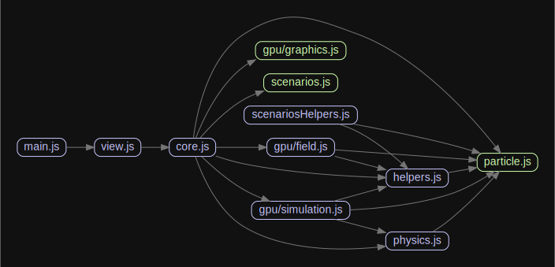

# Architecture and Simulation Lifecycle

This guide describes how particle.js starts, constructs its runtime objects, loads a scenario, and advances the simulation every frame.
It is the best starting point for understanding the project because the remaining guides all depend on the lifecycle described here.

Navigation: [Docs Index](./README.md) | [Next: Scenario Authoring and Physics Configuration](./scenario-authoring-and-physics-configuration.md) | [Project README](../README.md)



## Lifecycle Diagram

```mermaid
flowchart TD
	A[main()] --> B{WebGL2 available?}
	B -- yes --> C[simulationStart()]
	B -- no --> D[Render browser warning]
	C --> E[viewSetup()]
	E --> F[UI.start()]
	E --> G[Create helpers and GUI classes]
	E --> H[scenarioSetup()]
	H --> I[core.setup(idx)]
	I --> J[Create new SimulationGPU and FieldGPU]
	J --> K[simulation.setup(particleSetup)]
	K --> L[Scenario callback configures physics and particles]
	L --> M[drawParticles()]
	E --> N[animate()]
	N --> O[simulation.step(dt, time)]
	O --> P[graphics.compute()]
	N --> Q[graphics.render()]
```

The short version is:

- `src/main.js` verifies WebGL2 and starts the app
- `src/simulation/view.js` creates the UI and wires runtime input handlers
- `src/simulation/core.js` owns scenario selection and recreates the `SimulationGPU` instance on reset
- `src/simulation/graphics.js` owns the persistent renderer and GPGPU infrastructure
- `src/simulation/simulation.js` owns the particle list, stats, runtime actions, and per-frame stepping

## Startup Path

The startup path begins in `src/main.js`.
The `main()` function performs two top-level tasks:

1. initialize analytics when `ENV.production` is true
2. call `simulationStart()`

`simulationStart()` checks `WebGL.isWebGL2Available()` before doing anything else.
If WebGL2 is available, it calls `viewSetup()` from `src/simulation/view.js`.
If WebGL2 is not available, it renders the warning element returned by three.js into the root container.

This means the simulation and UI are not booted conditionally somewhere deep in the stack.
The capability gate lives at the application entry point.
That matters for documentation because browser support problems should be diagnosed from startup, not from shader code.

The same startup path also updates the `#info` element with `ENV.version` when that value is injected by webpack.
That is why development modes such as `test`, `test low`, and `record` surface their mode label in the UI without additional runtime plumbing.

## What `viewSetup()` Actually Does

`viewSetup()` in `src/simulation/view.js` is the runtime composition root.
It does more than attach event listeners.
It is the place where the application switches from static modules to a live simulation session.

The function performs the following responsibilities in order:

1. call `UI.start()` to mount the React application
2. create helper components such as `Mouse`, `Selection`, `Ruler`, and `Keyboard`
3. construct the simulation-side GUI classes
4. append the renderer canvas to `#renderer-container`
5. register resize, keyboard, and pointer event handlers
6. attach the stats overlay to `#statsPanel`
7. call `scenarioSetup()` to load the current scenario
8. start the animation loop with `requestAnimationFrame(animate)`

This is an important architectural split.
The React UI is mounted from the simulation layer, not the other way around.
That is why the UI guide treats the React layer as a presentation shell fed by simulation-owned state instead of as the owner of the simulation.

## Core Runtime Objects

The project has four central runtime objects.
Understanding who owns what prevents most accidental regressions.

| Object | Source | Ownership | Lifetime |
| --- | --- | --- | --- |
| `GraphicsGPU` | `src/simulation/core.js` | renderer, scene, camera, controls, GPGPU textures, render targets | singleton for the session |
| `SimulationGPU` | `src/simulation/core.js` | particle list, stats, action queue, `step()` logic | recreated on each `core.setup()` |
| `Physics` | `src/simulation/core.js` | force constants, booleans, shader-related config | recreated with the simulation unless explicitly reused |
| `FieldGPU` | `src/simulation/core.js` | probe particles and field visualization logic | recreated with the simulation |

The persistence model is intentional.
`GraphicsGPU` is created once at module scope in `src/simulation/core.js`.
When a scenario is reset, the code does not build a brand-new renderer or camera stack.
Instead, it creates a new `SimulationGPU` that reuses the same `GraphicsGPU` instance.

That design keeps the expensive renderer infrastructure stable while allowing the simulation and physics state to be replaced cleanly.
It also explains why some helpers only need to be initialized once even though the simulation object changes.

## The Live `simulation` Export

One of the easiest mistakes in this codebase is assuming that the exported `simulation` value is immutable.
It is not.

In `src/simulation/core.js`, the module exports:

```js
export let simulation = new SimulationGPU(graphics, new Physics());
```

Later, `Core.internalSetup()` does this:

```js
simulation = new SimulationGPU(graphics, newPhysics);
simulation.field = new FieldGPU(simulation);
```

That reassignment is not cosmetic.
It means every scenario reset replaces the `SimulationGPU` instance that other modules see.
Modules must therefore import it as a live binding:

```js
import { simulation } from './core.js';
```

Do not cache the object in a way that assumes it survives resets.
If you store a stale reference and then call methods on it after `core.setup()`, you will be operating on an orphaned simulation object while the rest of the app moves on.

This is the single most important lifecycle detail in the project.
If you only remember one thing from this guide, remember that `simulation` is a live exported variable, not a permanent singleton.

## Scenario Load Sequence

The scenario load flow begins in `scenarioSetup()` inside `src/simulation/view.js`.
The sequence is:

1. clean up graphics and stats panels from the previous run
2. reset GUI helper state such as selection and generator defaults
3. disable automatic camera rotation
4. call `core.setup(idx)`
5. restore axis visibility and optional cursor state
6. refresh GUI views so they reflect the new simulation state

Inside `core.setup(idx)`, the code:

1. resolves the scenario index or keeps the previous one
2. chooses the corresponding entry from `scenariosList`
3. calls `internalSetup()` to recreate `simulation` and `simulation.field`
4. calls `simulation.setup(this.particleSetup)`

Inside `SimulationGPU.setup(particleSetup)`, the code:

1. stores metadata such as `name` and `folderName`
2. calls `graphics.cameraDefault()`
3. invokes the scenario callback with the live simulation instance
4. sorts any deferred runtime actions by cycle
5. copies `mode2D` into `physics.mode2D`
6. restores the camera with `graphics.cameraSetup()`
7. applies `bidimensionalMode()` to the controls
8. computes particle radius information
9. calls `drawParticles()` to upload the particle list to the GPU

This sequence is why scenario callbacks should focus on configuring physics, camera intent, and particle creation.
They do not need to call `drawParticles()` themselves in the normal setup path.
`SimulationGPU.setup()` finishes the bootstrap sequence for them.

## Per-Frame Execution

Once the scenario has loaded, `animate(time)` in `src/simulation/view.js` drives the application.
The loop uses `requestAnimationFrame`, but it also applies a coarse gate with `simulationStepDelay = 1000 / 60`.
That means frames may be requested more often than simulation steps are executed.

The runtime flow in each animation cycle is:

1. request the next frame immediately
2. compute `dt` from the previous animation timestamp
3. skip the simulation step if the frame arrived too early
4. if not paused, resize the field if needed and call `simulation.step(dt, time)`
5. optionally recenter the camera on a followed particle
6. once per `viewUpdateDelay`, refresh the GUI state and rerender the React app
7. call `simulation.graphics.render()`
8. update the stats panel

`SimulationGPU.step(dt, time)` is intentionally narrow.
It does not own rendering.
Its main jobs are:

- call `graphics.compute(dt, time)` to advance GPU state
- increment cycle counters and total time
- collect rolling compute-time statistics
- execute scheduled actions when their target cycle is reached

That split keeps the simulation step focused on physics progression and delayed actions, while the outer view loop keeps responsibility for browser input, UI refresh cadence, and canvas rendering.

## Scheduled Actions

`SimulationGPU` exposes `addAction()` and `addActionArray()`.
These methods enqueue callbacks associated with specific simulation cycles.
The queue is sorted during `setup()`.
On each `step()`, the simulation checks the first action and executes it once its cycle is due.

This is how scenarios can schedule future events without creating their own ad hoc polling loop.
If you need a scenario to inject particles, flip a parameter, or trigger a staged event after a number of cycles, use the action list instead of teaching the view loop about scenario-specific timing.

## State Ownership by Layer

The project becomes easier to extend when you keep state in the layer that already owns it.
The rough rule is:

- `view.js` owns browser event wiring and frame cadence
- `core.js` owns scenario switching and mutable top-level simulation references
- `simulation.js` owns particle metadata, statistics, and scheduled actions
- `graphics.js` owns GPU resources and rendering
- `App.jsx` and the React views own dialog presentation state

The most common cross-layer mistake is moving simulation truth into the React tree.
The current codebase does not do that.
The UI mirrors simulation state, but it does not source it.
That distinction matters when you document or implement new features.

## Reset Semantics

Resetting a scenario is not the same as mutating an existing simulation back to defaults.
A reset does the following:

- clears graphics-owned scene children and transient render state through `graphics.cleanup()`
- rebuilds the `SimulationGPU` instance
- rebuilds the `Physics` instance unless a custom one is injected
- rebuilds the `FieldGPU` instance
- reruns the scenario callback to repopulate particles and settings

What does not get recreated is the renderer shell itself.
The same `GraphicsGPU` object survives.
That is why camera controls, renderer DOM wiring, and some UI helpers are established once and then reused.

## Architectural Boundaries Worth Preserving

There are a few boundaries that make the current structure workable:

- scenario files configure a simulation but do not own the main loop
- the UI can request changes, but `core.updatePhysics()` decides whether that means uniform refresh or shader rebuild
- `GraphicsGPU` is allowed to know about texture layout and shader source, but not about scenario-specific semantics
- `SimulationGPU` treats the particle list as its domain object and delegates GPU work instead of duplicating it

Preserving these boundaries keeps future documentation and future code changes aligned.

## Common Pitfalls

These are the lifecycle mistakes that are easiest to make:

- caching a stale `simulation` object across `core.setup()` calls
- changing physics flags directly and forgetting that some of them require shader regeneration
- assuming the React UI owns runtime state instead of mirroring it
- mutating JS particles after the GPU has advanced without first performing readback
- adding scenario-specific timing logic to `animate()` instead of using `SimulationGPU.addAction()`

## Practical Extension Checklist

When you add a feature that touches lifecycle code, verify the following:

1. the startup path still works from `src/main.js` to `viewSetup()`
2. scenario resets still recreate `SimulationGPU` cleanly
3. any new state has an obvious owner
4. UI refreshes are still driven from the existing runtime loop
5. GPU-backed state is synchronized intentionally instead of accidentally

If the change affects scenarios, continue with [Scenario Authoring and Physics Configuration](./scenario-authoring-and-physics-configuration.md).
If it affects controls or dialogs, continue with [UI Bridge and Runtime Controls](./ui-bridge-and-runtime-controls.md).
If it affects compute or render behavior, continue with [GPU Compute and Shader Pipeline](./gpu-compute-and-shader-pipeline.md).

Navigation: [Docs Index](./README.md) | [Next: Scenario Authoring and Physics Configuration](./scenario-authoring-and-physics-configuration.md) | [Project README](../README.md)
