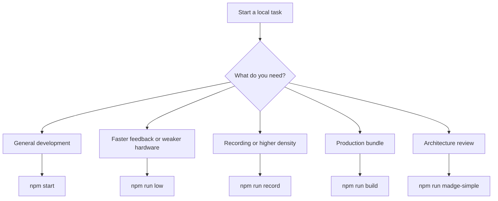

# Developer Workflows and Performance

This guide explains how to run particle.js locally, what each npm script is for, how webpack injects runtime flags, and how to think about performance limits in a GPU-backed particle simulator.

The project has a small headless test suite, but browser-based manual checks are still important for UI and visual behavior.
That makes local workflow discipline important even when automated checks pass.
When you change core behavior, your main verification loop is usually a combination of:

- choosing the correct local run mode
- loading one or more representative scenarios
- observing performance, UI behavior, and reset behavior directly in the browser

Navigation: [Previous: GPU Compute and Shader Pipeline](./gpu-compute-and-shader-pipeline.md) | [Docs Index](./README.md) | [Project README](../README.md)

## Workflow Selection Diagram



## Available npm Scripts

The canonical script list lives in `package.json`.
At the time of writing, the main scripts are:

| Script | Command Shape | Main Use |
| --- | --- | --- |
| `npm start` | alias for `npm run test` | normal development server |
| `npm test` | webpack dev server, `maxParticles=20e3` | standard development profile |
| `npm run low` | webpack dev server, `maxParticles=10e3` | lower particle budget for weaker hardware |
| `npm run record` | webpack dev server on port 8081, `maxParticles=50e3`, record mode | capture-focused workflow |
| `npm run build` | production webpack build, `maxParticles=10e3` | build distributable assets |
| `npm run prod` | alias for `npm run build` | production build shortcut |
| `npm run test:functional` | Vitest with `GraphicsHeadless` | Node headless lifecycle and contract checks |
| `npm run headless:serve` | webpack dev server for the headless harness on port 8090 | browser headless harness debugging |
| `npm run test:perf` | Playwright against the headless harness | Chromium headless GPU performance report |
| `npm run test:headless` | functional tests, then performance report | full local headless pass |
| `npm run madge0` | full dependency graph image | dependency inspection |
| `npm run madge1` | filtered graph image | lighter dependency inspection |
| `npm run madge2` | filtered graph plus npm dependencies | broader dependency inspection |
| `npm run madge-simple` | simplified graph image | architecture overview |

A contributor should almost never guess script behavior from the name alone.
The exact values are injected through the script definitions, so the documentation always needs to stay aligned with `package.json`.

## Headless Test Workflows

The project now has two complementary headless paths.

`npm run test:functional` runs in Node through `GraphicsHeadless`.
This path is intentionally deterministic and does not try to reproduce GPU physics.
It validates lifecycle contracts such as scenario setup, particle budget checks, finite statistics, scheduled actions, physics update policy, and JSON import/export behavior.

`npm run test:perf` runs Chromium through Playwright and loads a minimal browser harness instead of the React UI.
This path uses the real `GraphicsGPU`, WebGL renderer, and `GPUComputationRenderer`, so it is the right place to measure setup, compute, optional render, and readback costs.
The first version writes JSON reports under `reports/headless/` and only fails on structural problems such as missing WebGL2, setup exceptions, invalid metrics, or particle budget violations.
It does not fail on timing thresholds yet.

The headless workflows are local-first for now.
Do not add performance thresholds to CI until there is enough report history to choose stable baselines for the machines that run them.

## Standard Local Workflow

For a normal development session, use:

```bash
git clone https://github.com/andrenepomuceno/particle.js.git
cd particle.js
npm install
npm start
```

That starts webpack dev server with the development config and a nominal particle budget of 20k.
The app will be served from the dev server on the default port 8080.
This is the baseline mode you should use when:

- editing UI code
- adding or tuning scenarios
- changing physics values that do not require extreme particle counts
- validating reset, import, selection, and control behavior

## When to Use `low`

`npm run low` uses a lower nominal budget of 10k particles.
Use it when:

- your machine struggles with the normal development profile
- you are working on logic that does not need a dense particle count
- you want quicker feedback on startup and redraw operations
- you are debugging controls or lifecycle issues rather than visual density

This mode is also useful when you suspect a performance problem but want to separate algorithmic regressions from a too-large particle budget.
If the issue disappears in `low` mode, the next question is usually whether the regression is budget-sensitive or whether the scenario simply exceeds what the current hardware can handle comfortably.

## When to Use `record`

`npm run record` raises the nominal budget to 50k particles, switches the port to 8081, and enables `ENV.record`.
That flag causes `GraphicsGPU` to load `canvas-capture` and expose recording support through `simulation.graphics.capture(...)`.

Use this mode when:

- you need recorded output rather than only interactive debugging
- you want to test how a scenario behaves under a larger budget
- you need to verify recording-specific controls and media export behavior

Do not use record mode as your default development profile.
It is heavier, more specialized, and easier to misinterpret if you are only trying to validate normal UI or lifecycle changes.

## Build Output and Webpack Modes

The webpack configuration is split into three files:

- `webpack-common.config.js`
- `webpack-dev.config.js`
- `webpack-prod.config.js`

The common config defines:

- entry at `./src/main.js`
- output file `dist/main.js`
- Babel handling for `.js` and `.jsx`
- CSS support through `style-loader` and `css-loader`
- injected `ENV` values via `webpack.DefinePlugin`

The development config adds:

- `mode: 'development'`
- `devtool: 'eval-source-map'`
- polling watch options
- a dev server that serves the `dist` directory

The production config adds:

- `mode: 'production'`
- Terser-based minification

This means the environment model is not coming from `.env` files or a server-side runtime.
It is compile-time injection through webpack.

## The Meaning of `ENV`

Several runtime behaviors are controlled by webpack-injected `ENV` values.
Representative examples include:

- `ENV.maxParticles`
- `ENV.version`
- `ENV.record`
- `ENV.production`
- `ENV.gtag_config`

The codebase uses these values in a few important places:

- startup shows the current version label in the UI
- analytics only initialize in production mode
- `GraphicsGPU` derives its initial texture width from `ENV.maxParticles`
- recording support only loads when `ENV.record` is true

When a behavior looks environment-specific, start by checking the script definition and webpack config rather than searching for a runtime settings panel.

## Particle Budget and Texture Width

Performance discussions in this project usually start with particle capacity.
The renderer does not allocate one JS object per GPU slot lazily.
It allocates square textures and uses those textures to store particle state.

`GraphicsGPU` derives `textureWidth` from the nominal particle budget and then computes:

- `maxParticles = textureWidth * textureWidth`

This has two important consequences:

- the real GPU capacity is tied to a square texture, not a flat array length
- increasing the particle budget increases texture size, memory use, and compute work together

If a feature adds regular particles or field probes, it is consuming the same budget.
That is why field visualization can cause max-particle alerts even when the main scenario did not change.

## Practical Budget Guidance

A simple working rule is:

- 10k mode is the safest baseline for weak hardware and control-centric debugging
- 20k mode is the default development balance
- 50k mode is specialized and should be used intentionally

If a contributor reports that a scenario is slow, ask these questions first:

1. which mode are they running
2. how many regular particles does the scenario create
3. whether field probes are enabled
4. whether readback-heavy UI auto-refresh is enabled
5. whether the scenario forces repeated redraws or shader rebuilds

Most performance investigations become much clearer once those five variables are known.

## The Cost of Readback

`GraphicsGPU.readbackParticleData()` is one of the most important performance-sensitive operations in the codebase.
It reads render-target pixels from the GPU back into CPU arrays and updates the JS particle objects.

That cost is acceptable when readback is intentional.
It becomes a problem when a feature accidentally causes it too often.
Representative readback triggers include:

- particle selection and raycasting
- runtime particle editing
- runtime particle insertion
- auto-refreshing info views
- redraw paths that need current JS-side state

When a change unexpectedly slows down the app, check whether it introduced a new readback in a hot path.
That is often more actionable than micro-optimizing arithmetic in JavaScript.

## The Cost of Shader Regeneration

Another expensive path is shader regeneration.
Some runtime controls only update uniforms.
Others change feature flags that alter generated GLSL and force `graphics.drawParticles(..., true)`.

Repeatedly toggling shader-facing booleans or rebuilding the particle system in response to noisy UI changes can be expensive.
When implementing new controls, keep this distinction in mind:

- a committed value change is a good time for shader-sensitive updates
- per-keystroke recompilation is almost never a good idea

That is one reason the UI layer uses `onFinish` semantics instead of trying to push every input event straight into the GPU pipeline.

## Recording, Screenshots, and Export Flows

The project supports more than one export path.
The visible high-level flows include:

- screenshot export through the render canvas path
- simulation export and import through JSON zip helpers
- recording through `canvas-capture` in record mode

If you are changing export behavior, validate the right mode for the feature:

- screenshot and JSON export can be checked in normal development mode
- video recording should be checked in record mode

Do not assume a feature is broken if you are testing recording behavior without `ENV.record` enabled.
The corresponding capture dependency is conditionally loaded.

## Using Madge Outputs

The Madge scripts produce dependency graph images in `img/`.
These graphs are most useful when:

- you are trying to reduce coupling before a refactor
- you want a quick visual overview of which modules dominate the simulation layer
- you need to explain architecture to a new contributor

`npm run madge-simple` is the best first stop because it filters out much of the visual noise and leaves a clearer picture of the main runtime layers.
The more detailed graphs are still valuable, but they are less approachable for quick orientation.

## Troubleshooting Checklist

If the app is not behaving as expected locally, use this order of checks:

1. confirm WebGL2 is available in the browser
2. confirm you are running the script you think you are running
3. confirm the browser opened the expected port, especially in record mode
4. confirm the scenario does not exceed the current particle budget
5. confirm field probes are not silently consuming capacity
6. confirm a recent change did not introduce frequent readback or redraw operations
7. confirm the issue reproduces in `low` mode versus the normal development mode

This sequence rules out environment and budget issues before you spend time debugging scenario logic.

## Workflow Recommendations by Task

Use this quick mapping when choosing a workflow:

- UI changes: `npm start`
- scenario authoring: `npm start`, then `npm run low` if your hardware is close to the limit
- GPU debugging: `npm start` first, then move to `record` only if you need higher density or capture
- documentation screenshots or video capture: `npm run record`
- architecture review: `npm run madge-simple`
- release-style bundle verification: `npm run build`

## Before You Call a Change Done

Because the automated coverage is intentionally focused on headless contracts and performance reporting, a solid manual pass should still include:

1. one representative scenario reset
2. one UI interaction path related to your change
3. one check that the correct npm mode was used
4. one check for obvious performance regressions under the intended particle budget
5. one build run when the change affects bundling or environment behavior

If the change touches startup, lifecycle, UI control wiring, or GPU behavior, cross-reference the relevant guides in this folder before finishing the work.

Navigation: [Previous: GPU Compute and Shader Pipeline](./gpu-compute-and-shader-pipeline.md) | [Docs Index](./README.md) | [Project README](../README.md)
