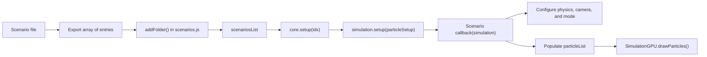

# Scenario Authoring and Physics Configuration

This guide explains how scenarios are registered, how they populate the simulation, and how the `Physics` object should be configured.
It is written for contributors who want to add a new experiment, tune an existing one, or understand the conventions already used in the project.

The key idea is that a scenario is not a separate runtime engine.
It is a configuration callback that receives the live `SimulationGPU` instance during setup and fills in the data that the shared engine will run.

Navigation: [Previous: Architecture and Simulation Lifecycle](./architecture-and-simulation-lifecycle.md) | [Docs Index](./README.md) | [Next: UI Bridge and Runtime Controls](./ui-bridge-and-runtime-controls.md) | [Project README](../README.md)

## Scenario Authoring Flow



## Where Scenarios Are Registered

Scenario registration happens in `src/simulation/scenarios.js`.
That file imports arrays from `src/simulation/scenarios_v0/` and `src/simulation/scenarios_v1/`, then flattens them into a single `scenariosList`.

The composition helper is:

```js
function addFolder(name, list) {
    list.forEach((value, index) => {
        list[index].folderName = name;
    });
    scenariosList = scenariosList.concat(list);
}
```

This means each scenario entry gains a `folderName` during registration.
The folder is presentation metadata used by the UI and by the simulation object after setup.
It is not a filesystem convention and it does not create an isolated namespace.

## Scenario Shape

A scenario entry is a plain object with two required fields:

```js
{
    name: 'Sandbox',
    callback: sandbox0,
}
```

The callback receives the live `SimulationGPU` instance.
Inside that callback you are expected to:

- configure physics values on `simulation.physics`
- set view-related choices such as 2D mode or camera distance
- populate `simulation.physics.particleList`
- optionally schedule actions with `simulation.addAction()`
- optionally add helper visuals such as a grid

The callback should not create its own renderer, browser loop, or UI root.
Those concerns are handled by the architecture described in the lifecycle guide.

## A Good Minimal Example

The simplest representative example is `src/simulation/scenarios_v0/sandbox.js`.
That file is useful because it separates two concerns clearly:

- a `defaultParameters(simulation, cameraDistance)` helper that establishes a baseline
- one or more scenario callbacks that make focused changes on top of that baseline

That pattern is worth keeping.
A scenario file becomes easier to read when shared defaults are centralized near the top of the file instead of copied into every callback.

The `defaultParameters()` helper in the sandbox file sets:

- camera defaults through `graphics.cameraDistance`, `graphics.cameraPhi`, and `graphics.cameraTheta`
- force constants and nuclear range on `physics`
- boundary parameters and collision distance
- particle radius defaults through `simulation.setParticleRadius()`
- 2D mode through `simulation.bidimensionalMode(true)`

That is a strong example of the intended setup order.

## Recommended Setup Order

In practice, the safest setup order for a new scenario is:

1. capture `graphics` and `physics` from the simulation for readability
2. establish baseline camera behavior
3. set force constants and physical scale
4. set boundary and collision parameters
5. set `simulation.mode2D` or call `simulation.bidimensionalMode()` if needed
6. set particle radius defaults
7. populate the particle list
8. add helper visuals such as the grid
9. add deferred actions if the scenario stages future events

`SimulationGPU.setup()` will call `drawParticles()` after the callback returns.
That is why scenarios normally configure and populate state first, then stop.
The upload step happens after the callback, not inside it.

## Which Particle List to Populate

The authoritative list for scenario setup is `simulation.physics.particleList`.
That same array is also exposed through `simulation.particleList` because the simulation constructor stores `physics.particleList` on the instance.

In other words, these two references point at the same list during normal setup:

- `simulation.physics.particleList`
- `simulation.particleList`

Most scenario helpers accept a list argument explicitly.
That is a good design choice because it makes the data flow obvious.
When authoring a scenario, prefer to pass the list into helpers rather than reaching into a module-global variable.

## Scenario Helpers

`src/simulation/scenariosHelpers.js` contains the main helper functions used by scenario files.
The most important ones are:

- `createParticle(list, mass, charge, nuclearCharge, position, velocity, fixed)`
- `createParticlesList(list, n, massCallback, chargeCallback, nuclearChargeCallback, positionCallback, velocityCallback, fixed)`
- `createNuclei0(...)`
- `createCloud3(...)`
- `atom0(...)`
- `createNucleiFromList(...)`
- `drawGrid(simulation, divisions)`

These helpers are valuable because they keep scenario files focused on intent instead of low-level particle construction.
They also preserve project conventions such as using `ParticleType.fixed` for immobile particles and generating particle groups through callbacks instead of manual loops.

## Helper Usage Strategy

Use helpers according to the shape of the system you are building:

- use `createParticle()` when the scenario needs a few hand-placed particles
- use `createParticlesList()` when the scenario needs a parametric distribution
- use `createNuclei0()` or `createNucleiFromList()` for nucleus-like clustered systems
- use `createCloud3()` for orbital or shell-like distributions
- use `drawGrid()` when the user needs a spatial reference in 2D mode

If a helper becomes so specialized that only one scenario can understand it, it probably belongs in that scenario file instead of in `scenariosHelpers.js`.
The shared helper module should stay biased toward reusable patterns.

## Physics Configuration Model

The `Physics` class in `src/simulation/physics.js` is the canonical place for default simulation parameters.
It groups together scalar constants, booleans that change shader behavior, and runtime statistics.

The fields are easier to reason about when grouped by role.

### Force and Potential Settings

These values define the main interaction model:

- `massConstant`
- `chargeConstant`
- `nuclearForceConstant`
- `nuclearForceRange`
- `nuclearPotential`
- `forceMap`

`nuclearPotential` is not a free-form function pointer.
It is a string enum selected from `NuclearPotentialType`.
The selected value later controls generated GLSL defines in the compute shader guide.

### Motion and Collision Settings

These values affect integration and contact behavior:

- `timeStep`
- `minDistance2`
- `maxVel`
- `enableColision`
- `enableLorentzFactor`
- `enableFineStructure`
- `enableRandomNoise`
- `enablePostGravity`

Note the squared form of `minDistance2`.
Several UI flows expose a linear distance to humans, but the stored physics value is squared.
Do not forget that distinction when writing scenario code or documentation.

### Boundary Settings

These control confinement:

- `enableBoundary`
- `boundaryDistance`
- `boundaryDamping`
- `useBoxBoundary`
- `mode2D`

The system supports both spherical and box-like boundaries.
The actual branch taken by the compute shader depends on booleans that are eventually turned into `#define` values.
That means some of these choices are not just uniform tweaks.
They alter shader behavior.

### Friction and Experimental Settings

These are secondary but still important for authoring:

- `enableFriction`
- `frictionConstant`
- `frictionModel`
- `enableColorCharge`
- `colorChargeConstant`

The friction model is selected through the `FrictionModel` enum.
Color charge is also a shader-facing toggle, not just a display tweak.

## Choosing 2D or 3D Mode

There are two related flags to keep in mind:

- `simulation.mode2D`
- `simulation.physics.mode2D`

`SimulationGPU.setup()` copies `simulation.mode2D` into `physics.mode2D` after the scenario callback runs.
`simulation.bidimensionalMode(enable)` also updates control behavior by disabling orbit rotation when 2D mode is on.

The practical rule is:

- use `simulation.bidimensionalMode(true)` when the scenario is truly 2D
- treat `simulation.mode2D` as part of scenario intent
- let the normal setup flow synchronize `physics.mode2D`

Avoid setting one flag and forgetting the other.
The existing setup flow is designed to keep them aligned when you use the intended methods.

## Runtime Particle Creation Versus Setup-Time Creation

During initial scenario setup, you can populate the list directly because no GPU state has been stepped yet.
Once the simulation is running, adding particles is different.

Runtime additions should go through `core.createParticleList()`.
That helper performs three critical steps:

1. validates against `graphics.maxParticles`
2. calls `graphics.readbackParticleData()` so JS objects match GPU state
3. normalizes and appends the incoming particles before redrawing them

If you append directly to the list after the simulation has already stepped on the GPU, the JS side may be stale and the resulting state can become inconsistent.
This is why the project separates setup-time authoring from runtime insertion.

## Adding a New Scenario

A safe workflow for adding a new scenario is:

1. create or update a scenario file inside `src/simulation/scenarios_v0/` or `src/simulation/scenarios_v1/`
2. export an array of scenario entries
3. write a shared `defaultParameters()` helper if multiple entries use the same scale
4. register the array in `src/simulation/scenarios.js` through `addFolder()`
5. run the project and confirm the scenario appears in the expected folder
6. verify the first frame draws correctly before tuning interaction constants

If the scenario uses an unusual physical scale, document that scale in comments local to the scenario file.
That is better than forcing future readers to reverse-engineer the unit conversion from constants alone.

## Common Mistakes in Scenario Code

These are the mistakes most likely to create confusing behavior:

- calling `drawParticles()` manually during normal scenario setup when `SimulationGPU.setup()` will already do it
- changing physics flags in a way that really belongs to the runtime `core.updatePhysics()` path
- forgetting that `minDistance2` is squared
- adding runtime particles by mutating the list directly instead of using `core.createParticleList()`
- relying on a scenario-specific helper that hides too much important setup logic
- mixing up visual radius choices with physical collision distance

## When to Use Direct Physics Assignment

Inside a scenario callback, direct assignment is expected and normal.
Examples include:

- `physics.massConstant = ...`
- `physics.nuclearPotential = ...`
- `physics.boundaryDistance = ...`

That is different from UI-driven runtime updates.
During runtime interaction, the project expects changes to flow through `core.updatePhysics()` because that method decides whether a change requires a uniform refresh or a full shader rebuild.
The same setting can therefore be safe to assign directly during setup but unsafe to mutate ad hoc during execution.

## Scenario Authoring Checklist

Before considering a scenario finished, verify the following:

1. the scenario appears in the intended folder and with the intended name
2. 2D or 3D mode behaves correctly from the first frame
3. particle counts stay within the configured budget
4. the chosen force constants and ranges are consistent with the scenario scale
5. runtime controls still behave sensibly after the scenario loads
6. the simulation can be reset without leaving stale objects behind

After you are comfortable with scenario authoring, continue with [GPU Compute and Shader Pipeline](./gpu-compute-and-shader-pipeline.md) if the new scenario requires shader-aware physics changes, or [UI Bridge and Runtime Controls](./ui-bridge-and-runtime-controls.md) if it needs new controls.

Navigation: [Previous: Architecture and Simulation Lifecycle](./architecture-and-simulation-lifecycle.md) | [Docs Index](./README.md) | [Next: UI Bridge and Runtime Controls](./ui-bridge-and-runtime-controls.md) | [Project README](../README.md)
